<!-- ===================== HEADER BANNER ===================== -->
<div align="center">


<!-- ===================== HEADER BANNER ===================== -->
<div align="center">


<a href="https://git.io/typing-svg">
  
</a>

<br/>


</div>

---

## 👨‍💻 About Me

<table>
<tr>
<td width="60%" valign="top">

I'm a **passionate Full Stack Developer** specializing in building **scalable, production-ready web applications**. I enjoy turning real-world problems into clean, reliable software, and I'm always learning modern technologies to deliver better solutions.

- 🎨 I care deeply about **clean, intuitive UI**
- ⚙️ I love **backend architecture, REST APIs, and database design**
- 🧩 I solve **real-world problems** through practical software
- 📚 I believe in **continuous learning** and writing maintainable code
- 🌍 Based in **Ethiopia 🇪🇹**, building for the world

</td>
<td width="40%" align="center" valign="middle">

```js
const mitiku = {
  role: "Full Stack Developer",
  location: "Ethiopia 🇪🇹",
  focus: ["Web Apps", "APIs", "Databases"],
  mindset: "Learn. Build. Improve.",
  status: "Open to opportunities ✅",
};
```

</td>
</tr>
</table>

---

## 🎯 Current Focus

| 🔭 Working On | 🌱 Learning | 🤝 Open To |
|:---|:---|:---|
| Scalable full-stack applications with **Next.js** & **Node.js** | Advanced **TypeScript**, system design & API architecture | Collaborations, freelance work & full-time roles |

---

## 🛠️ Tech Stack

<div align="center">



</div>

<details>
<summary><b>📋 View full skill badges</b></summary>
<br/>

<div align="center">


</div>
</details>

---

## 📊 GitHub Statistics

<div align="center">


<br/>


</div>

---

## 📈 Contribution Graph

<div align="center">


</div>

---

## 🚀 Featured Projects

<table>
<tr>
<td width="50%" valign="top">

### 🏢 Organization Member Management System (OMMS)
A full-stack platform for managing organization members, roles, records, and administrative workflows efficiently.


[](https://github.com/mitihans-1?tab=repositories)

</td>
<td width="50%" valign="top">

### ⛽ FuelSync
A fuel management solution designed to streamline tracking, distribution, and reporting with a clean, user-friendly interface.


[](https://github.com/mitihans-1?tab=repositories)

</td>
</tr>
<tr>
<td width="50%" valign="top">

### 🎓 University Grade Portal
A secure academic portal where students can view grades and administrators can manage results with role-based access.


[](https://github.com/mitihans-1?tab=repositories)

</td>
<td width="50%" valign="top">

### 🛒 MarketLink Marketplace
An online marketplace connecting buyers and sellers with product listings, search, and a smooth shopping experience.


[](https://github.com/mitihans-1?tab=repositories)

</td>
</tr>
</table>

---

## 🏆 Achievements

| | |
|:---|:---|
| 🚀 | Built **multiple full-stack applications** covering management systems, portals, and marketplaces |
| 🧱 | Designed **RESTful APIs** and structured **relational & NoSQL databases** |
| 🎨 | Delivered **responsive, modern interfaces** with React, Next.js & Tailwind CSS |
| 🔐 | Implemented **authentication and role-based access control** in real-world projects |
| 📈 | Committed to **continuous learning** and consistent open development on GitHub |

<div align="center">


</div>

<sub>✏️ *Replace the badges above with the GitHub achievements you've actually earned.*</sub>

---

## 🌐 Connect With Me

<div align="center">

[](https://github.com/mitihans-1)
[](https://linkedin.com/in/YOUR-LINKEDIN)
[](mailto:YOUR-EMAIL@example.com)
[](https://YOUR-PORTFOLIO.com)
[](https://t.me/YOUR-TELEGRAM)

</div>

---

<!-- ===================== FOOTER ===================== -->
<div align="center">

### 💬 *"Good software is built with clean code, clear thinking, and continuous learning."*

<br/>

⭐ **If you like my work, consider giving my repositories a star!** ⭐


<sub>Made with ❤️ by <b>Mitiku Etafa</b> • Ethiopia 🇪🇹</sub>

</div>

<a href="https://git.io/typing-svg">
  
</a>

<br/>


</div>

---

## 👨‍💻 About Me

<table>
<tr>
<td width="60%" valign="top">

I'm a **passionate Full Stack Developer** specializing in building **scalable, production-ready web applications**. I enjoy turning real-world problems into clean, reliable software, and I'm always learning modern technologies to deliver better solutions.

- 🎨 I care deeply about **clean, intuitive UI**
- ⚙️ I love **backend architecture, REST APIs, and database design**
- 🧩 I solve **real-world problems** through practical software
- 📚 I believe in **continuous learning** and writing maintainable code
- 🌍 Based in **Ethiopia 🇪🇹**, building for the world

</td>
<td width="40%" align="center" valign="middle">

```js
const mitiku = {
  role: "Full Stack Developer",
  location: "Ethiopia 🇪🇹",
  focus: ["Web Apps", "APIs", "Databases"],
  mindset: "Learn. Build. Improve.",
  status: "Open to opportunities ✅",
};
```

</td>
</tr>
</table>

---

## 🎯 Current Focus

| 🔭 Working On | 🌱 Learning | 🤝 Open To |
|:---|:---|:---|
| Scalable full-stack applications with **Next.js** & **Node.js** | Advanced **TypeScript**, system design & API architecture | Collaborations, freelance work & full-time roles |

---

## 🛠️ Tech Stack

<div align="center">

### Frontend


### Backend


### Databases


### Tools & Version Control


</div>

<details>
<summary><b>📋 View full skill badges</b></summary>
<br/>

<div align="center">


</div>
</details>

---

## 📊 GitHub Statistics

<div align="center">


<br/>


</div>

---

## 📈 Contribution Graph

<div align="center">


</div>

---

## 🚀 Featured Projects

<table>
<tr>
<td width="50%" valign="top">

### 🏢 Organization Member Management System (OMMS)
A full-stack platform for managing organization members, roles, records, and administrative workflows efficiently.


[](https://github.com/mitihans-1?tab=repositories)

</td>
<td width="50%" valign="top">

### ⛽ FuelSync
A fuel management solution designed to streamline tracking, distribution, and reporting with a clean, user-friendly interface.


[](https://github.com/mitihans-1?tab=repositories)

</td>
</tr>
<tr>
<td width="50%" valign="top">

### 🎓 University Grade Portal
A secure academic portal where students can view grades and administrators can manage results with role-based access.


[](https://github.com/mitihans-1?tab=repositories)

</td>
<td width="50%" valign="top">

### 🛒 MarketLink Marketplace
An online marketplace connecting buyers and sellers with product listings, search, and a smooth shopping experience.


[](https://github.com/mitihans-1?tab=repositories)

</td>
</tr>
</table>

---

## 🏆 Achievements

| | |
|:---|:---|
| 🚀 | Built **multiple full-stack applications** covering management systems, portals, and marketplaces |
| 🧱 | Designed **RESTful APIs** and structured **relational & NoSQL databases** |
| 🎨 | Delivered **responsive, modern interfaces** with React, Next.js & Tailwind CSS |
| 🔐 | Implemented **authentication and role-based access control** in real-world projects |
| 📈 | Committed to **continuous learning** and consistent open development on GitHub |

<div align="center">


</div>

<sub>✏️ *Replace the badges above with the GitHub achievements you've actually earned.*</sub>

---

## 🌐 Connect With Me

<div align="center">

[](https://github.com/mitihans-1)
[](https://linkedin.com/in/YOUR-LINKEDIN)
[](mailto:YOUR-EMAIL@example.com)
[](https://YOUR-PORTFOLIO.com)
[](https://t.me/YOUR-TELEGRAM)

</div>

---

<!-- ===================== FOOTER ===================== -->
<div align="center">

### 💬 *"Good software is built with clean code, clear thinking, and continuous learning."*

<br/>

⭐ **If you like my work, consider giving my repositories a star!** ⭐


<sub>Made with ❤️ by <b>Mitiku Etafa</b> • Ethiopia 🇪🇹</sub>

</div>
